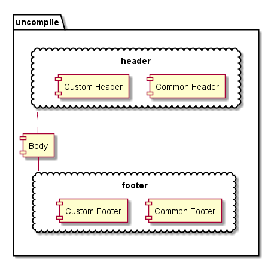

## part 1 关于重用Header Footer，处理Body 并允许灵活custom(增加，弃用)的设计
### 基本原则：与业务无关的代码片段组合全部放到编译阶段处理，不得占用服务器性能
### 设计要求：
#### * 编译阶段完成header中非业务相关标签的组合，主要是合并common和custom的css及script的引用
#### * 将首屏CSS打包进header中的
#### * 在header中留有与业务相关的数据的placeholder.目前主要是SEO相关的matedate.
#### * 在header footer中留有备用的placeholder.留做以后意外业务.
### 附加题：尝试在dev模式下实现开发人员免编译测试
### 方案一
